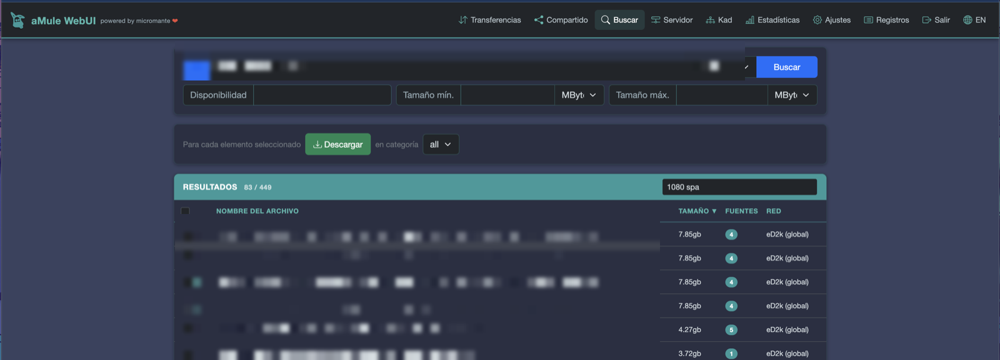
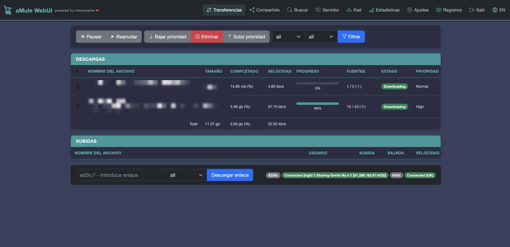
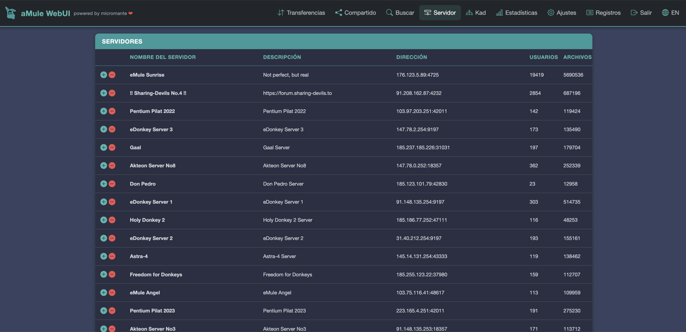
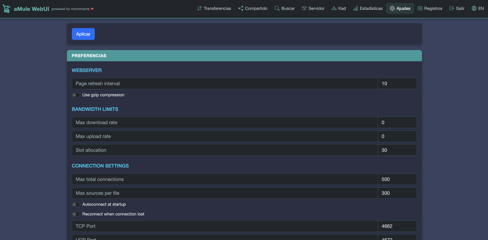
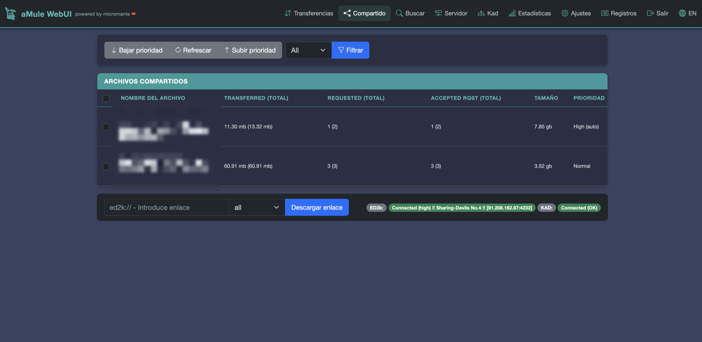
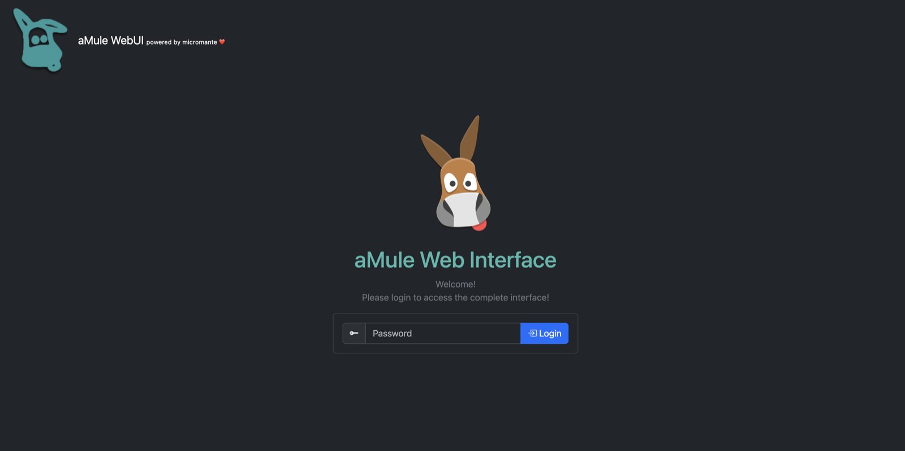

# aMule 3.0.0 Responsive WebUI Skin — Mobile-Friendly Bootstrap 5 Theme for amuleweb

A modern, **mobile-friendly web interface (WebUI) skin/theme for aMule 3.0.0**
(`amuleweb`). It **fixes several bugs** in the stock web template and rebuilds the
whole UI on **Bootstrap 5**, so the aMule web interface finally looks good and
works smoothly on **phones, tablets and desktops**.

If you run aMule on a headless server, NAS or **Raspberry Pi** and control it
from the browser over the eD2k / Kademlia (Kad) network, this skin gives you a
clean, responsive dark theme with real bug fixes — no more broken search, no
more desktop-only layout.

> Fork of [**AmuleWebUI-Reloaded Material Style**](https://github.com/MatteoRagni/AmuleWebUI-Reloaded)
> by MatteoRagni, adapted and improved for **aMule 3.0.0**.

**Keywords:** aMule web interface, amuleweb skin, aMule WebUI theme, aMule
responsive template, aMule mobile, aMule 3.0.0, eD2k / eMule / Kademlia, P2P
download manager UI, Bootstrap 5 dark theme, Raspberry Pi aMule.

## Screenshots

| Search | Downloads |
|:---:|:---:|
|  |  |
| **Servers** | **Settings** |
|  |  |
| **Shared files** | **Login** |
|  |  |

## Why this skin?

- 📱 **Truly responsive / works on mobile** — collapsible hamburger navbar,
  tables that fit any screen (no horizontal scroll; secondary columns hide on
  small screens) and stacking forms. The stock template was desktop-only and
  even missed the `viewport` meta tag.
- 🐛 **Real bug fixes** for aMule 3.0.0 — most importantly, search results that
  used to pile up across searches now show only the current search.
- 🎨 **Modern look** — Bootstrap 5 + Bootstrap Icons, consistent dark theme,
  readable buttons and spacing.
- 🌍 **Bilingual (English / Spanish)** interface with an instant language toggle.

## Features

### Responsive design (Bootstrap 5)
- Migrated from Bootstrap 3 to **Bootstrap 5** (with **Bootstrap Icons**): cards,
  a modern navbar and updated components.
- **Mobile-ready**: a hamburger menu that expands on tap, tables that fit the
  screen (no horizontal scroll — secondary columns are hidden on small screens)
  and forms that stack.
- Consistent dark theme across every page.

### Search
- Fixes the aMule 3.0.0 bug where a new search does not clear the previous
  results (`RemoveResults(0xffffffff)` matches no search id): client-side
  filtering shows only the results of the current search.
- Search submitted over AJAX (urlencoded) and results-only refresh, with no
  full page reloads.
- Dynamic text filter (space-separated AND terms) with a result counter.
- Client-side column sorting (name/size/sources), toggling ascending/descending.
- **Network** column showing the source of the search (Kad / eD2k + server).
- Per-row download button and a loading spinner.

### Downloads
- AJAX refresh of the tables only (no full page reload).
- Clean Bootstrap progress bars with the percentage shown under each bar.

### Languages (i18n)
- Full interface translation into **English** and **Spanish**.
- A navbar button to switch language instantly; the preference is stored in the
  browser and kept between sessions.
- Only the interface is translated: search results and file names are left as-is.

### General
- Larger fonts, readable button/icon colours and spacing tweaks.

## Installation on a Raspberry Pi (Raspbian / Ubuntu)

The skin is a set of static files (PHP templates, CSS and JS) that live in
`amuleweb`'s template directory. The path depends on how aMule was installed:

| Installation | Template directory |
|--------------|--------------------|
| Compiled from source (`/usr/local`) | `/usr/local/share/amule/webserver/` |
| `apt` package (Raspbian/Ubuntu) | `/usr/share/amule/webserver/` |

> Check which one is yours with:
> ```bash
> ls /usr/local/share/amule/webserver/ /usr/share/amule/webserver/ 2>/dev/null
> ```
> The rest of this README uses `/usr/local/share/amule/webserver` (compiled);
> replace it with `/usr/share/amule/webserver` if you installed via `apt`.

### Option A — Clone with git directly on the Raspberry Pi (over SSH)

SSH into the Pi and clone the repo into the template directory:

```bash
ssh pi@RASPBERRY_PI_IP

sudo apt update && sudo apt install -y git          # if you don't have git
cd /usr/local/share/amule/webserver
sudo git clone https://github.com/micromante/amule-3.0-webui-skin.git
```

This creates `/usr/local/share/amule/webserver/amule-3.0-webui-skin/`.

### Option B — Copy from your computer over SSH (scp / rsync)

If you have the files on your PC/Mac and don't want to use git on the Pi, copy
them over SSH. Since the destination needs root permissions, upload to a
temporary folder first and then move it with `sudo`:

```bash
# From your computer (not from the Pi)
scp -r /local/path/amule-3.0-webui-skin pi@RASPBERRY_PI_IP:/tmp/

# Then, over SSH on the Pi:
ssh pi@RASPBERRY_PI_IP
sudo mv /tmp/amule-3.0-webui-skin /usr/local/share/amule/webserver/
```

Alternatively with `rsync` (faster for updates, copies only what changed):

```bash
rsync -avz --rsync-path="sudo rsync" \
  /local/path/amule-3.0-webui-skin/ \
  pi@RASPBERRY_PI_IP:/usr/local/share/amule/webserver/amule-3.0-webui-skin/
```

### Option C — Direct copy (SD card / USB)

If you work with the SD card mounted on your computer or with a USB stick on the
Pi, copy the whole `amule-3.0-webui-skin` folder into the template directory
(`.../share/amule/webserver/`). The result must be the same: an
`amule-3.0-webui-skin` folder containing the `.php` files, `custom.css` and
`i18n.js`.

### Enabling the template

`amuleweb` selects the template by the **folder name**. Tell it on startup:

```bash
amuleweb --template=amule-3.0-webui-skin
```

Or set it permanently in aMule's configuration file. It is usually under the
home directory of the user running the daemon:

```
/home/<user>/.aMule/amule.conf       # e.g. /home/pi/.aMule/amule.conf
```

Edit it (with the daemon **stopped**, because `amuled` rewrites the file on
exit) and change the `Template` line in the `[WebServer]` section:

```bash
sudo systemctl stop amuled              # stop the daemon before editing
nano /home/pi/.aMule/amule.conf
```

Find the `[WebServer]` section and set `Template` to the **folder name** of the
skin. Example (the other lines are illustrative; the key one is `Template`):

```ini
[WebServer]
Enabled=1
Port=4711
Template=amule-3.0-webui-skin        ;  <-- LINE TO CHANGE (the folder name)
Password=<md5_hash_of_your_password>
UPnPWebServerEnabled=0
```

- `Template` → must match **exactly** the name of the folder you copied into
  `.../share/amule/webserver/` (here `amule-3.0-webui-skin`).
- If `Template` is not in your file, add it inside `[WebServer]`.
- `Password` is the **MD5 hash** of the web password (not plain text).

Restart the service to apply the changes (depending on your setup):

```bash
sudo systemctl restart amuled        # if it runs as a systemd service
# or restart amuleweb manually
```

The interface is then available at `http://RASPBERRY_PI_IP:4711`.

> **Note:** `amuleweb` requires authentication to serve the files (including
> `custom.css` and `i18n.js`). If, after installing, you see the web without
> styles or without the language selector, force a no-cache reload in the
> browser (`Ctrl+Shift+R`).

## Contributing

Contributions, ideas and suggestions are welcome! If you'd like to add a
feature, fix a bug or propose an improvement, please **open an
[issue](https://github.com/micromante/amule-3.0-webui-skin/issues)** or send a
**pull request** — it will be reviewed and considered.
